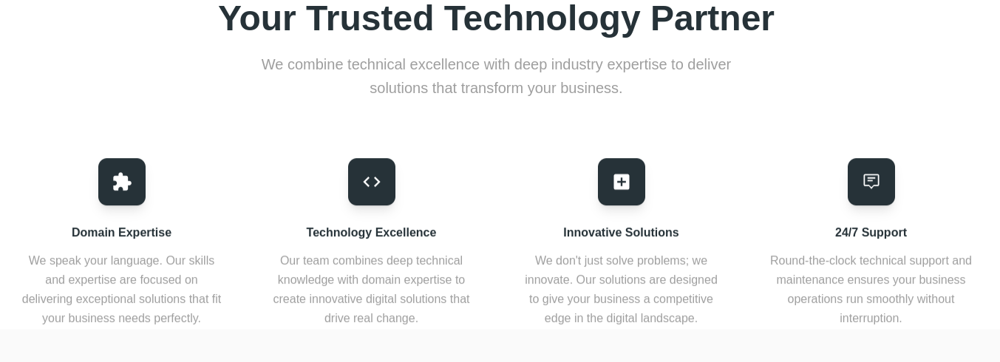

# Weblancer - Professional Web Development Agency




## Overview

Weblancer is a professional web development agency specializing in creating powerful digital solutions. Our portfolio showcases our expertise in:

- Web Development
- Mobile App Development
- Cloud Solutions
- UI/UX Design
- DevOps & Cloud Solutions
- Technical Consulting

## Features

- Modern, responsive design
- Built with Next.js 14 and Tailwind CSS
- Material Tailwind components
- Smooth animations and transitions
- SEO optimized
- Mobile-first approach
- Contact form integration
- Team showcase
- Client testimonials
- Achievement highlights

## Quick Start

1. Clone the repository:
    ```bash
    git clone https://github.com/yagyandatta/weblancer.git
    ```
2. Install dependencies:
    ```bash
    cd weblancer
    npm install
    ```
3. Start the development server:
    ```bash
    npm run dev
    ```
4. Open [http://localhost:3000](http://localhost:3000) in your browser.

## Tech Stack

- Next.js 14
- Tailwind CSS
- Material Tailwind
- TypeScript
- Framer Motion
- Hero Icons

## Browser Support

- Chrome (latest)
- Firefox (latest)
- Safari (latest)
- Edge (latest)

## Contact Information

- Email: weblancer@gmail.com
- Phone: +91 7077432031
- Location: Bhubaneswar, India

## License

© 2024 Weblancer. All Rights Reserved.

## Contributing

If you'd like to contribute, please fork the repository and create a pull request. You can also simply open an issue with the tag "enhancement".

1. Fork the Project
2. Create your Feature Branch (`git checkout -b feature/AmazingFeature`)
3. Commit your Changes (`git commit -m 'Add some AmazingFeature'`)
4. Push to the Branch (`git push origin feature/AmazingFeature`)
5. Open a Pull Request